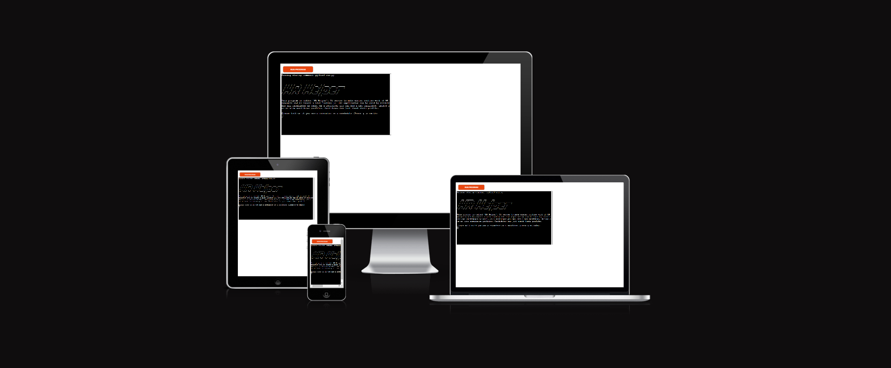
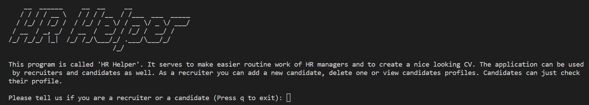

# HR Helper
HR Helper is an easy program that helps managers and candidates create and view their CV. It has the next features:
- Managers can create, veiw and load existing CV.
- Candidates can load their CV, if it doesn't exist they can add a new one to the database.

  

[Link to the application](https://hr-helper.herokuapp.com/)

## App intentions
Create an application that simplify HR manager daily routine.

## Creation process
- Strategy
    - The audience is HR managers and candidates who want to find a job of their dream. The app provides general functional and motivates both to use the programm.
- Scope
    - It will have several options for managers and only two for candidates.
- Structure

  

## Features
- Welcome message

  

- Recruiter delete option

  

- Recruiter add option

  

- Recruiter and candidate cv load options look the same

  

## Future features
- I am planing to add edit option for recruiters
- Add some colors to the text to make it nicer

## Personal testing
- The application was tested for errors with Python syntax checker.

  

## Libraries
- In this project I used a rich library to make a nice looking CV, os library to clear screen and gspread to access google sheets.

## Deployment
- Create a list with all requirements that will be read by Heroku (pip3 freeze > requirements.txt).
- Setting up Heroku:
  - Go to Heroku website
  - Login to Heroku and choose Create App
  - Create a new app
  - Choose a name and set your location
  - Navigate to the deploy tab
  - Click in Connect to Github
  - Navigate to the settings tab
  - Click on Add a buildpack on the same page. Select Python and node.js, ensuring Python is listed first after you save the changes.
- Deployment on Heroku:
  - Navigate to the Deploy tab
  - Choose main branch to deploy and enable automatic deployment to build Heroku everytime any changes are pushed on the repository
  - Click on manual deploy to build the app. When complete, click on View to redirect to the live site

## Credits
- The content of the application was developed by me.
- For the project I used next libraries: black, rich, gspread, os
- Input error check code I took from Code Institute project Love Sandwiches